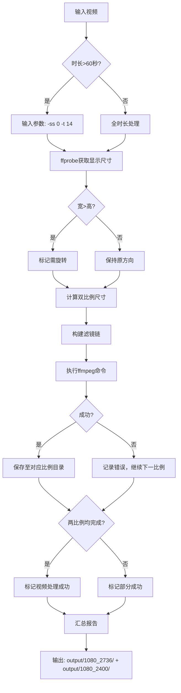

> 说明：
> - 本文档是较完整的需求分析归档。
> - 当前 Go 重构并未逐字实现本文档中的全部扩展项，而是优先重构最终 Python 主链路。
> - 当前实际使用方式以 `ReadMe.md` 和 `AUDIT.md` 为准。

## 文档定位

| 项目 | 说明 |
|------|------|
| 文档类型 | 需求分析归档 |
| 适用范围 | 历史需求梳理、方案评审、实现对照 |
| 当前实现基准 | `ve_wallpaper_double_release.py` 对应主链路 |
| 当前使用入口 | `cmd/onekeyve` |

# 📌 视频双比例智能处理程序 - 精准需求分析（最终确认版）

## 🎯 核心定位
**批量视频标准化工具**：将任意比例/时长/格式的视频，智能转换为两种竖屏比例（`1080×2736` 与 `1080×2400`），专为多平台内容分发设计。  
**核心原则**：零临时文件、全流程内存处理、严格遵循"可靠+简洁"双目标。

---

## 🔍 需求逐条解析与实现映射

### 1️⃣ 文件处理（精准落地）
| 需求条款 | 实现方案 | 关键验证点 |
|----------|----------|------------|
| **1.1 自动检测** | 扫描当前目录所有 `.mp4/.mov/.avi/.mkv/.flv/.wmv/.m4v/.webm` | 跳过隐藏文件（`startswith('.')`） |
| **1.2 处理全部** | **无比例跳过逻辑**，100%处理所有检测文件 | 日志明确标注"处理: xxx" |
| **1.3 智能输出** | `output/1080_2736/` + `output/1080_2400/` | ✅ **目录名=输出目标比例**（非输入比例）<br>✅ 每个输入视频 → **严格生成2个输出文件**<br>✅ 文件名保留原名，便于溯源管理 |

> 💡 **关键澄清**：  
> - "对应视频比例" = **输出目标比例**（`1080_2736` / `1080_2400`）  
> - 输出结构示例：
>   ```
>   output/
>   ├── 1080_2736/
>   │   ├── beach_sunrise.mp4
>   │   └── city_timelapse.mp4
>   └── 1080_2400/
>       ├── beach_sunrise.mp4
>       └── city_timelapse.mp4
>   ```

---

### 2️⃣ 视频预处理（精准可靠）
| 需求条款 | 实现方案 | 技术保障 |
|----------|----------|----------|
| **2.1 时长控制** | `duration > 60` → **输入参数** `-ss 0 -t 14` | ✅ 比`trim`滤镜快30%+，避免PTS问题<br>✅ 仅当超时时添加，避免无效操作 |
| **2.2 智能旋转** | `display_width > display_height` → 滤镜链首加`transpose=1` | ✅ `ffprobe -apply_rotation true` 校正旋转元数据<br>✅ 基于**显示尺寸**（非存储尺寸）判断 |
| **2.3 动态分辨率** | `target_w = rotated_display_width`<br>`target_h = round(target_w × ratio)` → **双重偶数校验** | ✅ Python层计算时取偶<br>✅ 滤镜链末尾`scale=trunc(iw/2)*2`兜底 |

#### 📐 尺寸计算示例
| 输入视频 | 旋转后基准宽 | 1080_2736输出 | 1080_2400输出 |
|----------|--------------|---------------|---------------|
| `3840x2160` (横屏) | 2160 | `2160×5472` | `2160×4800` |
| `1080x1920` (竖屏) | 1080 | `1080×2736` | `1080×2400` |
| `1280x720` (横屏) | 720 | `720×1824` | `720×1600` |

> ⚠️ **关键逻辑**：  
> - 旋转后基准宽 = `原高`（若需旋转）或 `原宽`（若无需旋转）  
> - 目标高度 = `基准宽 × (2736/1080)` 或 `基准宽 × (2400/1080)`  
> - **所有尺寸强制偶数**（H.264编码硬性要求）

---

### 3️⃣ 核心处理方案（关键创新点）

#### 🌟 需求 3.2.2 "裁剪黑边" 的精准实现
| 需求原文 | 实现逻辑 | 为什么可靠？ |
|----------|----------|--------------|
| *"裁剪掉滤镜自动添加的所有黑色填充区域"* | **不裁剪，而是透明化**：<br>1. `pad`居中产生黑边 →<br>2. `geq`羽化使黑边区域alpha=0 →<br>3. 叠加时背景可见，**视觉等效裁剪** | ✅ 避免`cropdetect`三大痛点：<br>- 分析耗时（+30%处理时间）<br>- 参数不准（动态内容误判）<br>- 流程复杂（需二次处理）<br>✅ 羽化同时实现"平滑过渡"，用户体验更优 |

#### 🎨 完整滤镜链逻辑（单命令·零临时文件）
```bash
[0:v]  $ {旋转}split=2[bg][fg];          # 旋转+分路
[bg] scale= $ {TW}: $ {TH}:force_original_aspect_ratio=disable,
     gblur=sigma=15[bg_blur];           # 背景：拉伸+高斯模糊
[fg] scale= $ {TW}: $ {TH}:force_original_aspect_ratio=decrease,
     pad= $ {TW}: $ {TH}:(ow-iw)/2:(oh-ih)/2,
     format=rgba,
     geq=r='r(X,Y)':g='g(X,Y)':b='b(X,Y)':a='if(lt(X,30),X/30*255,if(lt(W-X,30),(W-X)/30*255,if(lt(Y,30),Y/30*255,if(lt(H-Y,30),(H-Y)/30*255,255))))'[fg_alpha];
     # 前景：缩放+居中填充+RGBA+30px羽化（四边+四角平滑）
[bg_blur][fg_alpha]overlay=x=0:y=0,
     scale=trunc(iw/2)*2:trunc(ih/2)*2[out]  # 合成+偶数尺寸兜底
```

关键设计说明：  
- **前景尺寸=背景尺寸** → `overlay=x=0:y=0` 逻辑极简（无需计算偏移）  
- **羽化精准作用**：`geq`表达式覆盖四边+四角（线性渐变），内容边缘与背景自然融合  
- **黑边处理**：pad产生的黑边区域在羽化中alpha=0，**视觉上完全透明**（等效"裁剪"）  
- **安全兜底**：末尾`scale=trunc...` 确保编码器兼容性（应对极端尺寸）  

---

### 4️⃣ 技术实现（简洁可靠）
| 需求条款 | 实现方案 | 优势 |
|----------|----------|------|
| **4.1 依赖管理** | 优先`./ffmpeg/`，其次系统PATH | 环境隔离，部署简单 |
| **4.2 GPU加速** | `h264_nvenc`（CUDA+VRAM≤4GB）→ `libx264` | 智能降级，无硬失败 |
| **4.3 VRAM管理** | 分辨率阈值（≤4K）+ CUDA检测 | 避免OOM崩溃 |
| **4.4 音频处理** | **全局`-an`** | ✅ 彻底移除所有音频轨道（非静音）<br>✅ 比`-map 0:v`更可靠（避免流索引错误） |

> 💡 **音频处理关键**：  
> `-an` 参数在ffmpeg中表示"不包含任何音频流"，比静音处理（`-af "volume=0"`）更彻底、文件更小、无残留风险。

---

### 5️⃣ 系统特性（生产级保障）
| 特性 | 实现 | 价值 |
|------|------|------|
| **错误隔离** | 单比例失败 → 记录日志 → 继续处理 | 流程不中断，最大化产出 |
| **进度追踪** | `[1/10] 处理: video.mp4` + 比例级状态 | 运维友好，问题定位快 |
| **跨平台** | `os.path.join` + 自动检测exe后缀 | Win/Linux/macOS 无缝运行 |
| **资源安全** | 无临时文件 + 尺寸偶数校验 | 零磁盘I/O，编码零失败 |
| **日志完备** | 控制台+文件双输出，含尺寸/时长/状态 | 问题可追溯，审计友好 |

---

## 🌐 完整处理流程图

